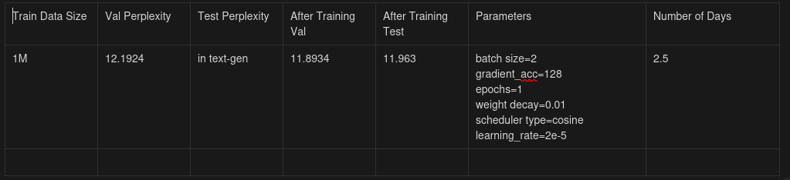

1. Create CMakeLists.txt. Update the CMAKE_PREFIX_PATH there
2. mkdir buid and cd build
3. cmake ..

After Making any changes to main.cpp
4. make (to compile)
5. ./main (to run)

Results for Training on 1M Dataset

